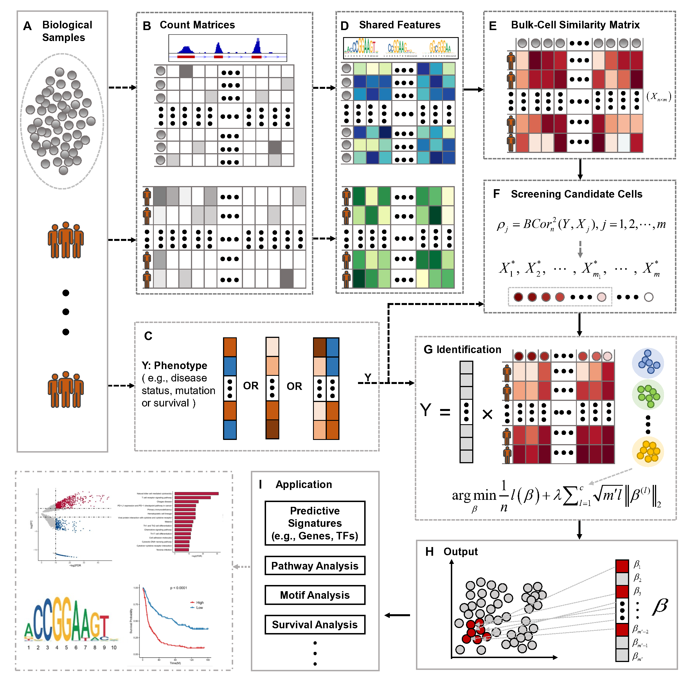

# PACells: Phenotype-Associated Cell ststes
PACells identifies clinical phenotype-associated cell states by integrating bulk and single-cell chromatin accessibility profiles

## Overview
We introduce PACells, a computational framework to identify cell states associated with clinical phenotypes from scATAC-seq data guided by bulk ATAC-seq data annotated with clinical phenotype information. PACells links phenotype information measured in bulk samples to individual cells in single-cell data and outputs the subset of cells most associated with the phenotype of interest (e.g., disease status, prognosis, treatment response), helping users interpret clinically relevant cellular heterogeneity. PACells also provides an optional extension for scRNA-seq guided by bulk RNA-seq data.

<p align="center">
 
</p>

## Installation

PACells is provided as an R package and can be installed directly from GitHub.

### Install from GitHub

```R
options(repos = c(CRAN = "https://cloud.r-project.org"))
if (!requireNamespace("devtools", quietly = TRUE)) install.packages("devtools")
devtools::install_github("jiaojhua/PACells")
```

### (Optional) Install a specific version

#### Option A: Install from a tag

```R
if (!requireNamespace("remotes", quietly = TRUE)) install.packages("remotes")
remotes::install_github("jiaojhua/PACells", ref = "v1.0.0")
```

#### Option B: Install from GitHub Releases (source tarball)

```R
if (!requireNamespace("remotes", quietly = TRUE)) install.packages("remotes")
remotes::install_url(
  "https://github.com/jiaojhua/PACells/releases/download/v1.0.0/PACells_1.0.0.tar.gz"
)
```

### Verify installation

```R
library(PACells)
packageVersion("PACells")
```

## Quick Start

Here, we provide a minimal quick-start tutorial using a binary phenotype (e.g., case/control) to demonstrate the basic PACells workflow. This example is intended as the simplest “run-through” to help users get PACells running end-to-end with standard settings. For more detailed usages, please refer to the ```Tutorials```.

### scATAC-seq (bulk ATAC-seq + scATAC-seq)

```R
library(PACells)

# Prepare TF motif set
motifs <- getMotifs(species = "Homo sapiens")

# phenotype should be aligned to bulk samples (columns of bulk_dataset)
sc_res <- PACells(
  sc_dataset   = sc_dataset,
  bulk_dataset = bulk_dataset,
  phenotype    = phenotype,
  motifs       = motifs,
  family       = "binomial"
)

table(sc_res$PACells_label)
```

**Tip (batch effect)**: if cells are mainly separated by batchs, consider ```batch = "harmony"```.

### scRNA-seq (bulk RNA-seq + scRNA-seq)

```R
library(PACells)

# sc_mat: genes x cells; bulk_mat: genes x samples
sc_res_rna <- PACells.RNA(
  sc_dataset   = sc_mat,
  bulk_dataset = bulk_mat,
  phenotype    = phenotype,
  family       = "binomial"
)

table(sc_res_rna$PACells_label)
```


## Tutorials

* For the binary phenotype task on CLL datasets, please see [here](https://github.com/jiaojhua/PACells/blob/main/tutorials/Tutorial_CLL.ipynb), datasets are available at this [link](https://drive.google.com/drive/folders/1JQetE5ugbmdUmZ6O2wbgPT33SBCiCLqp?usp=drive_link).

* For the binary phenotype task on AD datasets, please see [here](https://github.com/jiaojhua/PACells/blob/main/tutorials/Tutorial_AD.ipynb), datasets are available at this [link](https://drive.google.com/drive/folders/1WgXQ7JgUcKGD8deWTGhJi-JCIe1vMAyQ?usp=drive_link).

* For the survival phenotype task on GBM datasets, please see [here](https://github.com/jiaojhua/PACells/blob/main/tutorials/Tutorial_GBM.ipynb), datasets are available at this [link](https://drive.google.com/drive/folders/1zDTsYs4u7Hp6qaUyDsu4v19W7eoo-2Lg?usp=drive_link)

## Dependencies
- Seurat, Signac
- chromVAR, chromVARmotifs, motifmatchr
- SummarizedExperiment
- SGL, gam, survival
- snowfall

## Contact
If you have any suggestions or problems, please feel free to contact Jiao Hua (jhua@stu.hit.edu.cn).
